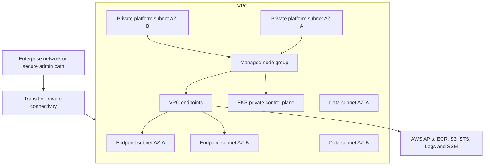

# Terraform AWS Enterprise Platform

A sanitized, production-inspired Terraform reference implementation for an enterprise AWS platform foundation. It demonstrates how I structure secure networking, private service access, mandatory resource ownership tags and an Amazon EKS control plane without reproducing any employer environment.

## What this project demonstrates

- VPC and multi-AZ subnet segmentation for platform, data and endpoint tiers
- Optional controlled internet egress through a NAT gateway
- Gateway and interface VPC endpoints for private AWS API access
- Private-only EKS API access and encrypted Kubernetes secrets
- Managed node groups with explicit IAM roles and scaling boundaries
- Default and mandatory tags for ownership, department, environment and automation
- Security groups designed around intent rather than broad source ranges
- Terraform inputs, outputs and example environment configuration

## Architecture



## Repository layout

```text
.
├── providers.tf             # Terraform and AWS provider configuration
├── variables.tf             # Typed and validated inputs
├── network.tf               # VPC, subnets, routes and controlled egress
├── endpoints.tf             # Gateway and interface VPC endpoints
├── eks.tf                   # Private EKS cluster and managed node group
├── outputs.tf               # Useful platform outputs
├── examples/dev.tfvars      # Synthetic example configuration
└── docs/architecture.md     # Design decisions and trade-offs
```

## Quick start

```bash
terraform init
terraform fmt -check -recursive
terraform validate
terraform plan -var-file=examples/dev.tfvars
```

The example deliberately uses placeholder names and the synthetic `10.42.0.0/16` address space. Review service quotas, organizational policies, approved Kubernetes versions, DNS, routing and identity controls before adapting the pattern.

## Important design decisions

### Private EKS API

The Kubernetes API endpoint is private by default. Administrative access should arrive through a controlled corporate path, bastion, VPN, Direct Connect or transit architecture rather than being exposed publicly.

### Endpoint-first service access

ECR, S3, STS, CloudWatch Logs and Systems Manager endpoints reduce dependence on public internet paths. NAT remains optional for workloads that genuinely require outbound internet access.

### Mandatory ownership metadata

Every resource receives `Resource_Owner`, `Department`, `Environment`, `Project` and `Managed_By` tags. In a real organization these should be reinforced with service control policies, tag policies and CI validation.

### Failure-domain awareness

Platform and endpoint subnets span two availability zones. A single NAT gateway is included only as a cost-conscious lab option; production workloads should explicitly decide between per-AZ resilience, centralized egress or endpoint-only connectivity.

## Security note

This repository contains no cloud account IDs, production CIDRs, internal DNS names, credentials, state files or employer configuration. Run secret scanning and inspect every plan before publishing adaptations.
